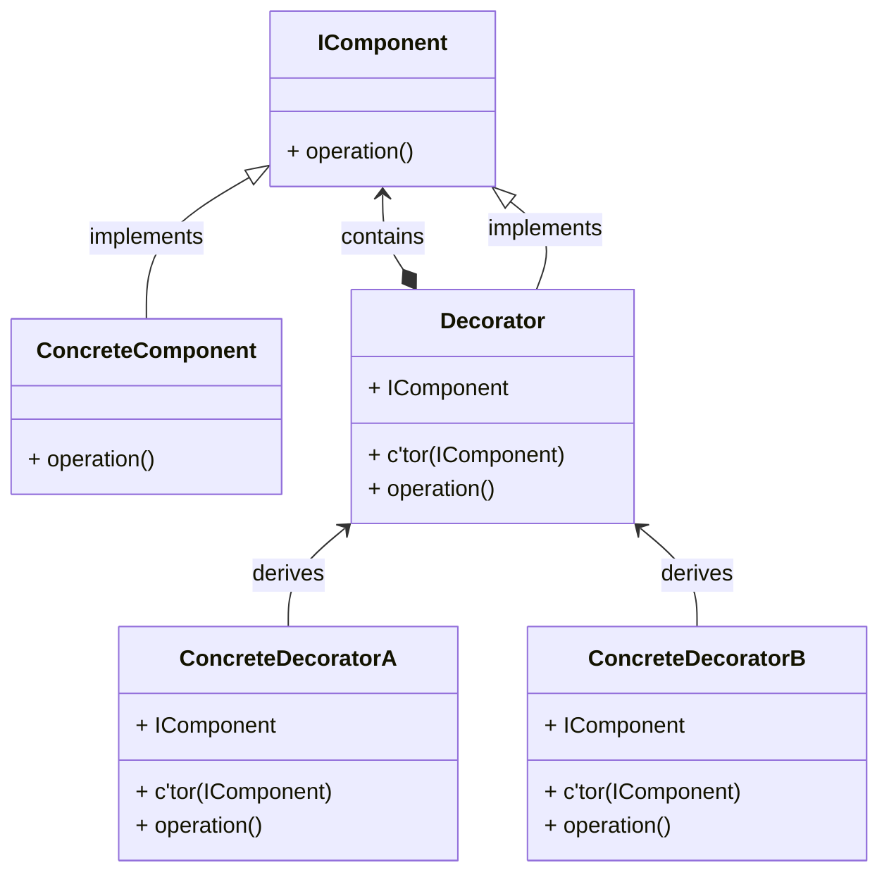

# Decorator Pattern

## Introduction

Decorators add functionality to a existing class. Its a flexible alternative to the creation of subclasses.





The abstract decorator implements the IComponent interface. This is that afterwards, the derived concrete decorators can be called by the same interface and are not recognized as decorators from outside.

The abstract decorator holds an instance on the interface. This is that a call of the overwritten operation() method can be passed-through to instance.operation(), additionally to our own added custom functionality.

Benefits:

* Multiple Decorators can be chained. This avoids long deviation hierarchies.

  >  Composition over inheritance
  >
  > it is better to compose what an object can do ("HAS-A") than extend what it is ("IS-A").
  >
  > * More flexible Design
  > * Enables IoC Patterns
  > * More loose coupling
  > * Better extensibility / modifyability

  

* Supports the "Open-Close-Principle"

## Implementation

```csharp
public abstract class UiElement {
    public abstract void Draw();
}

public class Button : Uielement {
    public override void Draw() {
        Console.WriteLine("Drawing button.");
    }
}

public abstract class Dekorator : UiElement
{
    private UiElement myUiElement;

    public Dekorierer(UiElement e) {
        myUiElement = e;
    }

    public override void Draw() {
        myUiElement.Draw();
    }
}

public class ButtonWithBorder : Dekorator
{
    public ButtonWithBorder(UiElement e)
        : base(e)
    { }

    public override void Draw() {
        base.Draw();
        Console.Write("Drawing border.");
    }
}

public class ButtonWithShadow : Dekorator
{
    public ButtonWithShadow(UiElement e)
        : base(e)
    { }

    public override void Draw() {
        base.Draw();
        Console.Write("Drawing shadow.");
    }
}


public static void Main()
{
    UiElement myButton = new Button();
    myButton.Draw();

    UiElement myButtonWithBorder = new ButtonWithBorder(myButton);
    myButtonWithBorder.Draw();

    UiElement myButtonWithShadow = new SchnupfenDekorierer(myButton);
    myButtonWithShadow.Draw();

    # Decorator chaining
    UiElement myButtonWithBorderAndShadow = new ButtonWithBorder(
        									new ButtonWithShadow(myElement));
    myButtonWithBorderAndShadow.Draw();
}
```

## Testing

